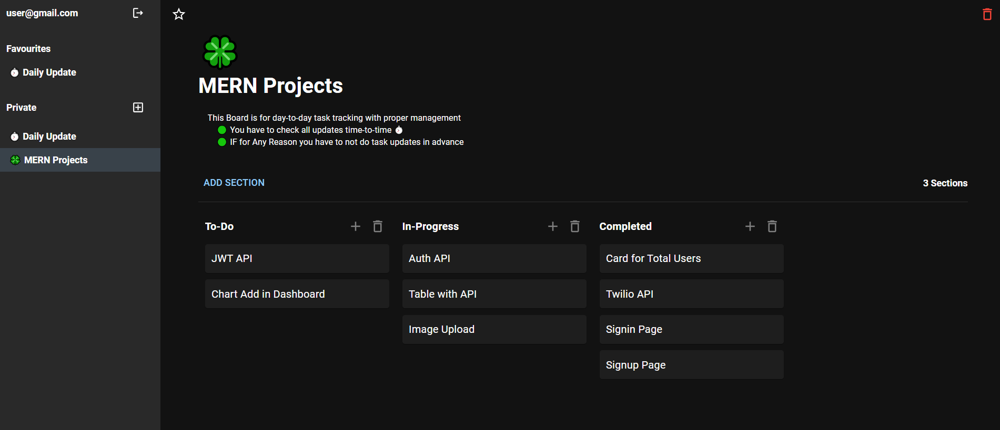

# Kanban 

The Kanban app provide you to manage the all task as you want.

# Snapshot



# Demo

[Kanban - Live ◀️](https://kanban-dhyanpatel110.vercel.app/)

## Project setup

### Clone this repo

```
git clone https://github.com/dhyanpatel110/Kanban-Client.git
```

### Install dependencies

```
npm install
```

### Compiles and hot-reloads for development

```
npm run start
```

### Compiles and minifies for production

```
npm run build
```

### Lints and fixes files

```
npm run lint
```
